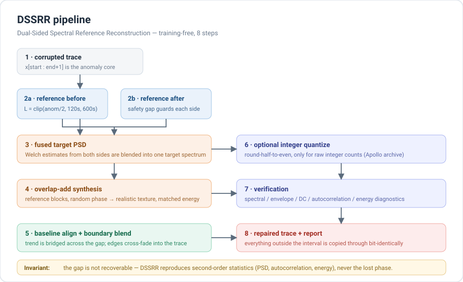

<p align="center">
  
</p>

<h1 align="center">DSSRR &mdash; Dual-Sided Spectral Reference Reconstruction</h1>

<p align="center">
  <b>Training-free, statistically faithful long-gap repair for planetary and seismic time series.</b>
</p>

<p align="center">
  <a href="https://opensource.org/licenses/MIT"></a>
  
  
</p>

---

DSSRR fills corrupted or missing intervals in a time series by fusing power
spectral density (PSD) estimates taken from the healthy data on **both** sides
of the gap, synthesising a replacement with realistic waveform texture, and
blending it seamlessly into the surrounding trace.

No training data, no model fitting, no learned weights. It stays stable for
gaps from a few seconds to over **90 minutes**, where interpolation, SSA and
plain FFT extrapolation degrade sharply.

The method was developed for **Apollo lunar seismic (PSE) records** and ships
with the detection / batch-repair pipeline and the desktop tooling used to
produce the results in the accompanying paper.

## Table of contents

- [How it works](#how-it-works)
- [Installation](#installation)
- [Quick start](#quick-start)
- [Examples](#examples)
- [Desktop GUI](#desktop-gui)
- [Batch repair from the command line](#batch-repair-from-the-command-line)
- [Parameters](#parameters)
- [Key features](#key-features)
- [Limitations](#limitations)
- [Repository layout](#repository-layout)
- [Sample data, provenance and acknowledgements](#sample-data-provenance-and-acknowledgements)
- [FAQ](#faq)
- [Citation](#citation)
- [License](#license)

## How it works



1. **Locate the anomaly core.** You pass inclusive sample indices `[start, end]`.
2. **Extract two reference windows.** One before and one after the gap, each of
   length `L = clip(anomaly/2, 120 s, 600 s)` by default
   (see [`auto_reference_length`](#reference-length)). A safety gap (default
   1 s) separates the anomaly from each reference so the anomaly never leaks in.
3. **Fuse a target PSD.** Welch estimates from both references are combined
   into a single target spectrum, so a non-stationary neighbour on one side
   cannot dominate.
4. **Synthesise the replacement.** Reference blocks with randomised phase are
   overlap-added and rescaled to match the target spectrum's energy &mdash; this
   is what gives the fill realistic texture instead of a smooth line.
5. **Align and blend.** The low-frequency trend is bridged across the gap and
   the edges are cross-faded so no step is visible at the joins.
6. **Optional quantisation.** For raw integer counts (e.g. the Apollo archive)
   the repaired samples can be rounded back onto the original integer grid.
7. **Verify.** Spectral, envelope, DC, autocorrelation and energy diagnostics
   are returned alongside the data.
8. **Return.** A repaired copy plus a full report. **Every sample outside the
   anomaly interval is copied through bit-identically.**

> **The one thing DSSRR cannot do:** recover the original phase inside the gap.
> It reproduces second-order statistics (PSD, autocorrelation, energy
> distribution). A one-off transient that happened during the dropout is
> unrecoverable &mdash; by any method.

## Installation

```bash
pip install dssrr
```

The scientific core needs only **numpy + scipy**. Everything else is an
optional extra:

| Extra | Adds | For |
|---|---|---|
| *(none)* | numpy, scipy | library + CLI batch repair |
| `dssrr[batch]` | obspy, pandas | reading MiniSEED, writing catalog CSVs |
| `dssrr[gui]` | PyQt5, matplotlib, obspy, pandas | the desktop application |
| `dssrr[nn]` | torch | neural-network inpainting (optional repair method) |
| `dssrr[dev]` | pytest + tooling | running the test suite |
| `dssrr[all]` | gui + batch extras | everything except the optional torch backend |

```bash
pip install "dssrr[gui]"      # desktop app
pip install "dssrr[all]"      # everything
```

From a source checkout:

```bash
git clone https://github.com/YSP0Github/DSSRR.git dssrr && cd dssrr
pip install -e ".[gui]"
```

## Quick start

```python
import numpy as np
from dssrr import DSSRR, auto_reference_length

sr = 6.625                                  # Apollo long-period sampling rate
data = ...                                  # 1-D array, your trace

start, end = 12_000, 16_000                 # inclusive anomaly sample indices

# Pick a reference window from the anomaly length (120-600 s protocol)
ref = auto_reference_length(end - start + 1, sr)

model = DSSRR(sr=sr, reference_sec=ref, seed=42)
repaired = model.repair(data, start, end)   # numpy array, same shape

# Or get the full provenance / quality report too:
repaired, report = model.repair_with_report(data, start, end, random_seed=42)
print(report["verification"]["energy_ratio"])
```

Two guarantees you can rely on:

```python
assert repaired.shape == data.shape
assert np.array_equal(repaired[:start], data[:start])        # outside untouched
assert np.array_equal(repaired[end + 1:], data[end + 1:])
```

### Integer-count data (`quantize`)

By default the repaired segment stays **floating point**, which is correct for
physical-unit traces (velocity / displacement / acceleration). If your input is
**raw integer counts** &mdash; such as Apollo archival data on a 10-bit grid &mdash;
enable `quantize` so the repaired samples land on the same discrete grid as the
rest of the record:

```python
model = DSSRR(sr=sr, reference_sec=300, quantize=True)
repaired = model.repair(data, start, end)          # integer output
repaired = model.repair(data, start, end, quantize=True)   # or per call
```

Rounding is `np.rint` (round-half-to-even) and is applied **only inside the
anomaly interval**; everything outside stays bit-identical.

### Reference length

```python
from dssrr import auto_reference_length
ref_sec = auto_reference_length(anomaly_samples, sr)     # clip(anom/2, 120, 600)
```

Half the anomaly duration is enough for a stable spectral estimate; the bounds
keep the window short enough to stay locally stationary.

## Examples

Five runnable, heavily commented scripts live in [`examples/`](examples/) &mdash;
see [`examples/README.md`](examples/README.md) for the full index.

| Script | What it shows |
|---|---|
| [`01_quickstart.py`](examples/01_quickstart.py) | Smallest possible call; the two invariants; the report dict |
| [`02_long_gap_baseline.py`](examples/02_long_gap_baseline.py) | DSSRR vs linear interpolation vs FFT extrapolation on a 10-min gap |
| [`03_real_apollo_mseed.py`](examples/03_real_apollo_mseed.py) | Repair a real Apollo record, scored against the held-out truth |
| [`04_report_plot.py`](examples/04_report_plot.py) | Publication-style repair report figure |
| [`05_batch_cli.py`](examples/05_batch_cli.py) | Drive the batch pipeline from Python |

```bash
python examples/01_quickstart.py
python examples/03_real_apollo_mseed.py --data-dir /path/to/mseed --sr 6.625
```

## Desktop GUI

A PyQt5 application with a two-page main window: a **Repaired DB Viewer**
(compare the raw and repaired archives) and a **Manual Repair** panel
(select an interval with the mouse, try repair methods, preview, export).

```bash
pip install "dssrr[gui]"
dssrr-gui                    # console script
python -m dssrr.gui          # equivalent module entry point
```

On Windows a helper launcher is provided at the repository root
(`启动DSSRR.bat`); on Unix use `./launch_gui.sh`. Both honour a `DSSRR_PYTHON`
environment variable if you need a specific interpreter.

Both database roots can also be preset from the environment, which is handy for
scripted launches and editor run configurations:

| Variable | Effect |
|---|---|
| `DSSRR_RAW_ROOT` | Pre-fills the **Raw DB** field on both the viewer and the Batch Repair page |
| `DSSRR_FIX_ROOT` | Pre-fills the **Repaired DB** field (otherwise it is derived as `<raw>_repaired`) |
| `DSSRR_PYTHON` | Interpreter used by `launch_gui.sh` / `启动DSSRR.bat` |
| `DSSRR_LANG` | Language of the whole interface (and of the exported report). Defaults to `en`; set to `zh` for Chinese. A language picked with the sidebar button overrides it |

```bash
DSSRR_RAW_ROOT=examples/data DSSRR_FIX_ROOT=examples/data_repaired python -m dssrr.gui
DSSRR_LANG=zh python -m dssrr.gui      # Chinese interface + Chinese report figure
```

### Language

The GUI is **bilingual (English / 中文)**. Use the `Language: 中文` button at the
bottom of the sidebar to switch; the choice is remembered in
`QSettings(APP_ORG, APP_NAME)` under `UI/Language` and restored on the next start.
Switching re-labels every open panel immediately, including the matplotlib
navigation toolbars (which are third-party widgets whose text is not routed
through `self.tr()`).

How it works &mdash; there is no `.qm` toolchain involved:

* `dssrr/gui/translations_zh.py` is a plain `{english source: chinese}` dict
  (423 entries covering 100% of the `self.tr()` / `QCoreApplication.translate()`
  string constants under `dssrr/gui/`).
* `dssrr/gui/i18n.py` installs a `QTranslator` **subclass** that looks `source`
  up in that dict and ignores `context`. Because it sits on the `QApplication`,
  all ~580 existing `self.tr()` call sites work untouched, and any new one you
  write is translated for free.
* A missing entry must return `None` (a null `QString`) so Qt falls back to the
  English source. Returning `""` would be treated as a real, empty translation
  and blank out the whole English interface &mdash; `tests/test_gui_i18n.py`
  locks this down.

Text that lives outside the widget tree (report figures, axis labels, the
severity/recommendation strings in the diagnostics panel, the export-settings
dialog) is resolved by `dssrr.i18n.resolve_language()`, in this order:

1. an explicit `lang=` argument (e.g. `RepairReportPlotter(sr=..., lang="zh")`),
2. the process-level language set by the sidebar button (`dssrr.i18n.set_language`),
3. the `DSSRR_LANG` environment variable,
4. **English**.

The system locale is deliberately *not* consulted &mdash; earlier releases guessed
from it, which made a Chinese Windows show a Chinese export dialog inside an
otherwise English interface.

### Segment selection and the zoom/pan mode

Dragging on the waveform selects an anomaly segment, but matplotlib's Pan and
Zoom modes take `canvas.widgetlock`, which silently swallows the selection
events. When either mode is active the hint next to the navigation toolbar turns
into a warning &mdash; *"Zoom/pan is active &mdash; segment selection is disabled.
Click Zoom or Pan again to turn it off, then drag to select."* &mdash; and
switches back to the normal instructions once you leave the mode.

The batch page and the manual panel call **the same algorithms** as the library
&mdash; there is a single source of truth for the repair maths
(`tests/test_single_source_of_truth.py` enforces it).

## Batch repair from the command line

Cross-platform, no PyQt required &mdash; suitable for headless servers:

```bash
dssrr-batch \
  --raw-root /data/apollo/raw \
  --fix-root /data/apollo/repair \
  --stations S12,S15 \
  --d0 19760101 --d1 19760131
```

It runs the full pipeline: E7 anomaly detection &rarr; multi-level repair &rarr;
moonquake-catalogue protection &rarr; per-month catalog CSV &rarr; automatic
verification &rarr; summary JSON. Exit status is `0` when verification passes for
every repaired file.

Full option list, directory conventions and worked examples:
[`docs/CLI.md`](docs/CLI.md).

```python
from dssrr.cli import quick_scan, batch_repair

print(quick_scan("/data/raw", ["S12"], 19760101, 19760131)["files"])

summary = batch_repair("/data/raw", "/data/repair", ["S12"],
                       19760101, 19760131)
print(summary["verify"]["ok"])
```

## Parameters

`DSSRR(...)` constructor arguments:

| Parameter | Default | Meaning |
|---|---|---|
| `sr` | &mdash; | Sampling rate in Hz (must be positive) |
| `reference_sec` | `300.0` | Reference window length **per side**, in seconds |
| `seed` | `42` | Seed for deterministic synthesis; `None` = fresh randomness |
| `quantize` | `False` | Round the repaired samples back to integers |
| `config` | `None` | Overrides merged onto `dssrr.config.DEFAULT_CONFIG` |

`repair(...)` / `repair_with_report(...)` keywords: `reference_before_sec`,
`reference_after_sec`, `safety_gap_sec`, `random_seed`, `quantize`.

All thresholds &mdash; detection, spectral estimation, synthesis, layered
synthesis, joining, verification &mdash; live in one place:
[`dssrr/config.py`](dssrr/config.py). Pass `config={"verification": {...}}` to
override any of them.

```python
from dssrr import get_config
cfg = get_config()
cfg["synthesis"]["random_seed"] = 7
```

## Key features

- **No training required** &mdash; no labelled data, no learned weights, works out
  of the box on any locally stationary seismic time series.
- **Statistical fidelity** &mdash; preserves PSD, autocorrelation structure and
  energy distribution, not just pointwise smoothness.
- **Robust for long gaps** &mdash; stable up to 90+ minutes, where simple methods
  collapse.
- **Seamless boundaries** &mdash; trend alignment and phase-constrained edge
  blending remove visible steps at the joins.
- **Non-destructive** &mdash; data outside the anomaly interval is never touched.
- **Lightweight core** &mdash; numpy + scipy only; importing `dssrr` never pulls
  in a GUI toolkit.
- **Three tiers, one implementation** &mdash; library, CLI and GUI share the same
  code path.

## Limitations

- DSSRR reproduces **second-order statistics**, not the original phase inside the
  gap. A transient event during the dropout cannot be reconstructed.
- It assumes the signal inside the gap is statistically similar to the adjacent
  healthy segments (local stationarity). A regime change across the gap biases
  the fused target spectrum.
- Reference windows shorter than ~120 s (at 6.625 Hz) give poor low-frequency
  resolution.
- The bundled `QualityVerifier.spectral_continuity` compares **raw**
  (unsmoothed) periodograms over 0.5&ndash;3 Hz, so its absolute value is
  realisation-dependent: two independent draws from the same process score
  ~0.5 rather than ~1.0. Treat it as a diagnostic, not an absolute
  pass/fail gate &mdash; the batch pipeline's structural acceptance checks
  (`dssrr.repair_lib.e7_repair_build.verify_file`) are the authoritative ones.

## Repository layout

```
dssrr/
├── core.py              the DSSRR pipeline (ReferenceSpectrumReplacer)
├── spectral.py          two-sided PSD estimation and fusion
├── synthesizer.py       reference-block overlap-add synthesis
├── verifier.py          quality diagnostics
├── config.py            every threshold in one dict (DEFAULT_CONFIG)
├── cli.py               dssrr-batch entry point
├── paths.py             canonical user file locations (+ legacy fallback)
├── gui/                 PyQt5 desktop application
│   ├── main.py          integrated main window (viewer + manual repair)
│   ├── viewer.py        raw/repaired archive comparison viewer
│   ├── manual_repair.py interactive interval repair
│   ├── depulse_dialog.py the multi-method repair panel
│   ├── batch_repair.py  batch page
│   └── icons/           app icon (SVG + rasterised PNG/ICO)
└── repair_lib/          Apollo-specific detection + repair pipeline
    ├── e7_detector.py       anomaly detection (MISSING/FREEZE/SAT/SPIKE/…)
    ├── e7_repair_build.py   per-file multi-level repair + verification
    ├── repair_engine.py     ObsPy glue for the GUI
    ├── depulse_advanced.py  Isolation Forest / LOF / NN inpainting
    ├── report_plot.py       repair report figures
    └── anomaly_repair/      the three public replacers (+ re-export shims)
```

The companion **reproduction package** for the paper — the analysis drivers, the
figure scripts and the instance-level result tables behind every figure and
table — is in [`reproduce/`](reproduce/README.md).

## Sample data, provenance and acknowledgements

`examples/data/` contains three 12-hour **Apollo 12 / 15 / 16** long-period
vertical records (network `XA`, channel `MHZ`, 6.625 Hz, 1976-01-13) so that the
examples and tests can run against real archival data with no download step.
They are small, freely redistributable fixtures and are **not** installed with
the Python package. See [`examples/data/README.md`](examples/data/README.md) for
the full provenance and licensing statement.

The batch pipeline ships a merged moonquake catalogue assembled from:

- Gagnepain-Beyneix, J., et al. (2006), *A seismic model of the lunar mantle and
  constraints on Moon's composition*, PEPI.
- Lognonné, P., et al. (2003), *Moon meteoritic seismic hum: steady state
  prediction*, JGR.
- The Apollo PSE Long-Period Event Catalog (rev. 1008c).

Apollo lunar seismic data were produced by NASA's Apollo Lunar Surface
Experiments Package (ALSEP) and are distributed openly through the
[IRIS / EarthScope Data Management Center](https://ds.iris.edu/ds/nodes/dmc/).
This project is not affiliated with or endorsed by NASA or IRIS.

## FAQ

**Does DSSRR need a GPU or training?**
No. It is a classical spectral method &mdash; numpy + scipy only. The optional
`[nn]` extra adds a neural inpainting *alternative*, but it is not used by the
default DSSRR path.

**Will it change my data outside the gap?**
Never. The repaired array is a copy in which only `[start, end]` differs.

**Why does my result differ between runs?**
The synthesis phase is randomised. Pass a fixed `seed` / `random_seed` for
reproducible output; `None` deliberately requests fresh randomness.

**Can I use it on non-Apollo data?**
Yes &mdash; pass your own `sr` and choose the reference length with
`auto_reference_length`. The `repair_lib` detection pipeline, however, is tuned
for Apollo MHZ records and its anomaly classes (MISSING / FREEZE / SAT / SPIKE /
STEP / BURST) assume that instrument.

**A long gap got left unrepaired in batch mode.**
Gaps longer than `max_repair_sec` are intentionally **not** reconstructed: DSSRR
marks them in the catalog rather than fabricating data.

## Citation

If you use this code, please cite:

> Yu, S., Li, X. (2026). Dual-Sided Spectral Reference Reconstruction for
> long-duration artifact repair in Apollo lunar seismic records.
> *Seismological Research Letters* (submitted).

Software archived at https://doi.org/10.5281/zenodo.23192456 (Zenodo).

## License

MIT &mdash; see [LICENSE](LICENSE).
